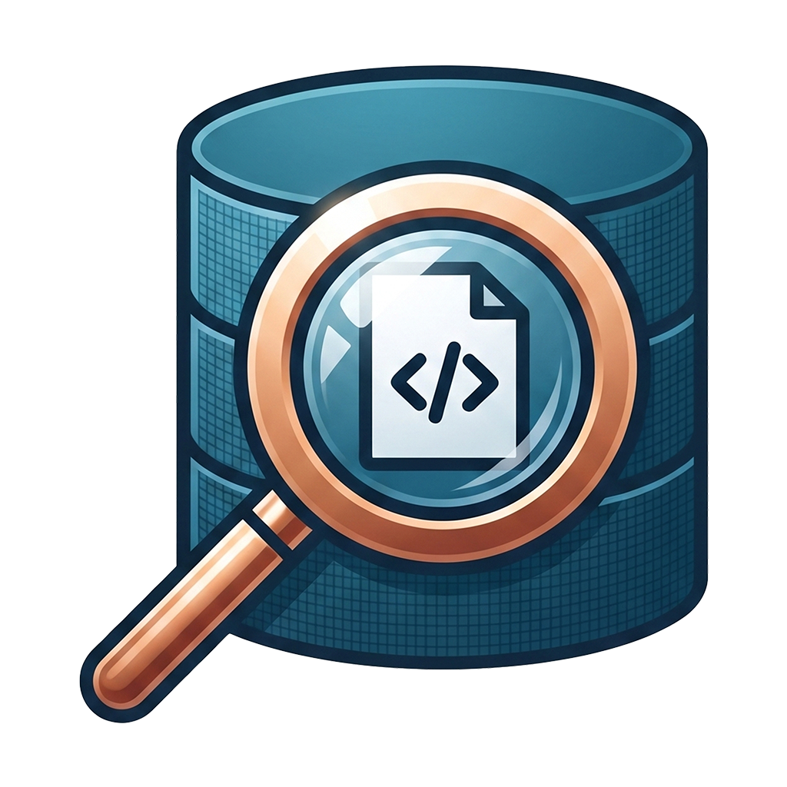
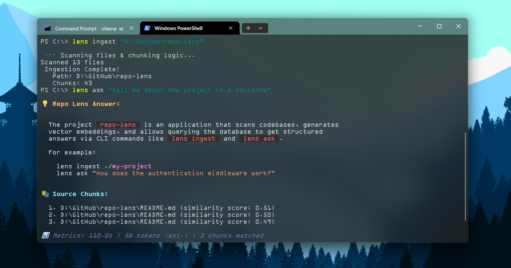
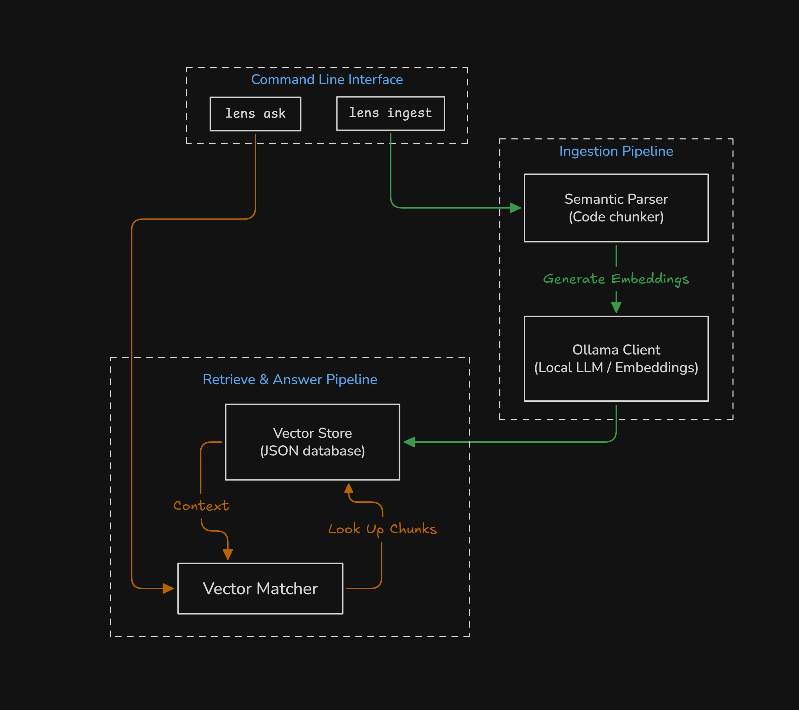
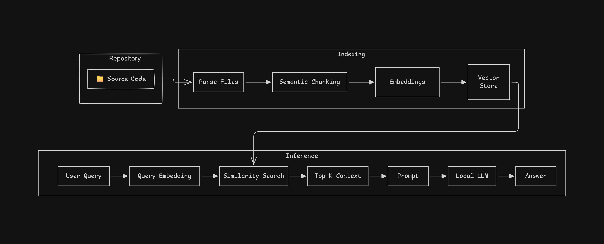

<div align="center">
  <a href="https://github.com/buggy-bits/repo-lens">
    
  </a>
</div>

<h3 align="center">Repo Lens</h3>

<p align="center">A command-line utility built to perform offline, privacy-first codebase Q&A using local Large Language Models (LLMs) and vector embeddings via Ollama.</p>


## How It Works

### Ingestion & Indexing
When you run ingestion command, the parser scans the target directory. It filters out files matching ignore lists (like node_modules, lockfiles, or files larger than 500KB) and checks remaining files against allowed extensions. 

The content of each valid file is split into semantic blocks using a sliding window chunking algorithm. This splits text line-by-line using a target chunk size of 1500 characters and a 300 character boundary overlap to maintain structural context between chunks. Each text block is sent to the local Ollama service to obtain a numeric vector representation using the configured embedding model (`nomic-embed-text:v1.5` by default) and written to the local vector JSON store.

### Querying & Retrieval
When asking a question via `lens ask`, the tool embeds your prompt and calculates the cosine similarity score between the prompt's vector and the database vectors. The top `N` matched code chunks are extracted, formatted alongside file locations, and injected into a custom prompt template. This context-enriched prompt is then sent to the local Ollama chat model (`qwen2.5:7b` by default) to generate and stream the final answer to your terminal with syntax highlighting.

 ## Screenshots

<div align="center">
  
  
</div>

## Project Architecture

<div align="center">
  
</div>

The application is structured into modular components:
*   **CLI Cmd**: Handled using Cobra to parse and route commands, flag parameters, and CLI flag overrides.
*   **Config**: Manages user configurations in `config.yaml` using dynamic defaults and environment checks.
*   **Parser**: Performs language-agnostic codebase tokenization and chunking.
*   **Store**: Handles file-based loading and writing of serialized vector database indexes.
*   **Vector**: Implements cosine similarity search to rank relevant code blocks.
*   **Ollama Client**: Handles HTTP interaction with the local Ollama API to retrieve text embeddings and stream chat outputs.

---

## RAG Pipeline

<div align="center">
  
</div>


---

## Download and Setup

### 1. Prerequisite: Install Ollama
Before using Repo Lens, download and run Ollama on your machine.
Pull the default models needed:
```powershell
ollama pull qwen2.5:7b
ollama pull nomic-embed-text:v1.5
```
You can also use models that your system supports, for that set `model` in configuration file.

### 2. Download Binary and Path Setup
Compile or download the `lens` binary executable from the Releases section.


#### On Windows:
1. Create a dedicated folder (e.g., `C:\Program Files\repo-lens`).
2. Move the `lens.exe` executable into that folder.
3. Add this folder path to **Path** variable under **System Variables** section.
4. Click **New** and append your folder path (`C:\Program Files\repo-lens`).

You can verify the installation by running the following command in Command Prompt or PowerShell:
```powershell
lens status
```

## Usage & Commands

All commands read their default settings from your configuration file located at:
```text
"C:/Users/<username>/AppData/Roaming/repo-lens/config.yaml"
```

You can temporarily override these default settings using **Global CLI Flags** or by using **Command-Specific Flags**.

---

Make sure you have your ollama server running before using the project.

Start ollama server
```powershell
ollama serve
```

List available models
```powershell
ollama list
```

## Command Summary

A quick reference table of all available `lens` commands:

| Command       | Description                                                                     |
| :------------ | :------------------------------------------------------------------------------ |
| `lens ingest` | Scans the codebase, generates vector embeddings, and builds the search index.   |
| `lens ask`    | Queries the vector database and returns structured, markdown-formatted answers. |
| `lens status` | Checks the health of your Ollama instance, models, and vector database.         |
| `lens clear`  | Deletes the vector database file and resets the codebase search index.          |
| `lens set`    | Permanently modifies key configuration options in your local config file.       |


---

## Detailed Reference

### `lens ingest [directory]`
Scans the codebase in the target directory, splits supported files into chunks, retrieves vector embeddings, and saves the database index to disk.

**Usage:**
```powershell
lens ingest ./my-project
```

**Flags:**
| Flag                | Short |   Type   | Description                                                  |
| :------------------ | :---: | :------: | :----------------------------------------------------------- |
| `--embedding-model` | `-e`  | `string` | Override the default embedding model used for vectorization. |

---

### `lens ask "[question]"`
Queries the vector database and returns structured answers with markdown rendering. 
*Note: If run in an interactive terminal, this command presents a Bubble Tea spinner and streaming text animations for a rich CLI experience.*

**Usage:**
```powershell
lens ask "How does the authentication middleware work?"
```

**Flags:**
| Flag            | Short |   Type   | Description                                                         |
| :-------------- | :---: | :------: | :------------------------------------------------------------------ |
| `--model`       | `-m`  | `string` | Override the default LLM model used to generate the answer.         |
| `--top-results` | `-k`  |  `int`   | Override the number of matched source chunks retrieved for context. |

---

### `lens status`
Performs a comprehensive health check of your environment. It pings your local Ollama instance to verify connection health, checks for the availability of configured LLM/embedding models, and verifies if the vector database file is properly initialized.

**Usage:**
```powershell
lens status
```

---

### `lens clear`
This effectively resets the codebase search index, requiring a fresh **ingestion** to rebuild it. User confirmation is needed to safely delete the vector database file. 

**Usage:**
```powershell
lens clear
```

---

### `lens set [key] [value]`
Modifies key configuration options in the config file permanently. 

**Usage:**
```powershell
lens set top-results 10
```

**Supported Keys:**
| Key                 | Description                                                     |
| :------------------ | :-------------------------------------------------------------- |
| `model`             | The default LLM model to use for generating answers.            |
| `embedding-model`   | The default model to use for generating vector embeddings.      |
| `top-results`       | The default number of source chunks to retrieve during a query. |
| `ollama-url`        | The URL endpoint for your local Ollama instance.                |
| `vector-store-path` | The file path where the vector database index is saved.         |
| `mode`              | The operational mode of the application.                        |

---

## Global Flags

These flags can be appended to any command to temporarily override configuration file settings for that specific execution:

| Flag           |   Type   | Description                          |
| :------------- | :------: | :----------------------------------- |
| `--config`     | `string` | Path to a custom configuration file. |
| `--mode`       | `string` | Override the operational mode.       |
| `--ollama-url` | `string` | Override the Ollama instance URL.    |

## Libraries Used

*   **github.com/spf13/cobra**: CLI application bootstrap command and flag router.
*   **github.com/charmbracelet/bubbletea**: Interactive terminal runtime loop engine.
*   **github.com/charmbracelet/lipgloss**: Layout designer, borders, and colors in terminals.
*   **github.com/charmbracelet/glamour**: High-quality terminal markdown renderer.
*   **gopkg.in/yaml.v3**: YAML document parser and encoder.
*   **golang.org/x/term**: Platform-native secure stdin password masking.

